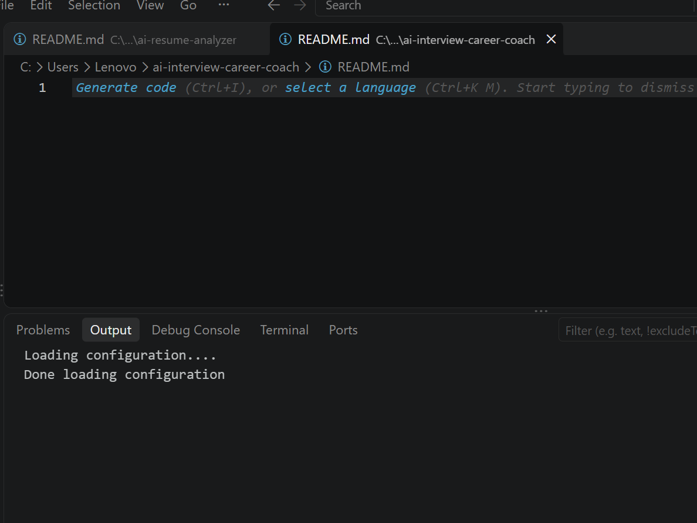

# 🎯 AI Interview & Career Coach

An AI-powered interview preparation and career coaching application built with Python, Streamlit, and Google Gemini AI.

The application analyzes a candidate's resume and job description, generates personalized interview questions, and evaluates interview answers with AI-powered feedback.

## 🚀 Features

- 📄 Upload Resume in PDF format
- 🤖 AI-powered Resume Analysis
- 💼 Job Description Analysis
- 🎯 Personalized Interview Question Generation
- 🧠 AI Mock Interview
- 📊 Interview Answer Scoring
- ⭐ Answer Quality Evaluation
- 💪 Strength Identification
- ⚠️ Areas for Improvement
- ✨ Better Answer Suggestions
- 🔄 Follow-up Question Generation
- 📋 Resume and Job Description Matching
- 🎤 Interview Preparation Support

## 🧠 How It Works

The application follows a simple AI-powered interview preparation workflow:

1. Upload your resume in PDF format.
2. Enter or provide the target job description.
3. The application analyzes your resume and job requirements.
4. AI generates personalized interview questions.
5. Answer the interview questions.
6. AI evaluates your answer.
7. The system provides:
   - Answer Score
   - Answer Quality
   - Strengths
   - Areas for Improvement
   - Better Answer
   - Follow-up Question

## 🛠️ Technologies Used

- Python
- Streamlit
- Google Gemini AI
- Google GenAI SDK
- PyPDF
- Generative AI
- Prompt Engineering

## 📂 Project Structure

ai-interview-career-coach/

│
├── app.py
├── requirements.txt
├── .gitignore
├── screenshots/
│   └── ai-interview-career-coach-demo.png
└── README.md

## ▶️ How to Run

### 1. Clone the repository

git clone https://github.com/harishmishra666/ai-interview-career-coach.git

### 2. Open the project folder

cd ai-interview-career-coach

### 3. Install dependencies

pip install -r requirements.txt

### 4. Configure Gemini API

Create a `.env` file and add your Gemini API key:

GEMINI_API_KEY=your_api_key_here

### 5. Run the application

streamlit run app.py

The application will open in your browser.

## 📸 Application Demo

## 🎯 Project Purpose

The goal of this project is to demonstrate how Generative AI can be used to build an intelligent career and interview preparation assistant.

The application combines resume analysis, job description matching, personalized question generation, and AI-powered answer evaluation into a single workflow.

## 🔮 Future Improvements

- 🎙️ Voice-based mock interviews
- 📹 Video interview analysis
- 📈 Interview performance dashboard
- 🧑‍💼 Multiple job-role specific interview modes
- 📊 Interview history and progress tracking
- 🔊 AI voice interviewer
- ☁️ Cloud deployment

## 👨‍💻 Author

**Harish Mishra**

AI & Automation | Agentic AI | Generative AI | Python

GitHub: harishmishra666